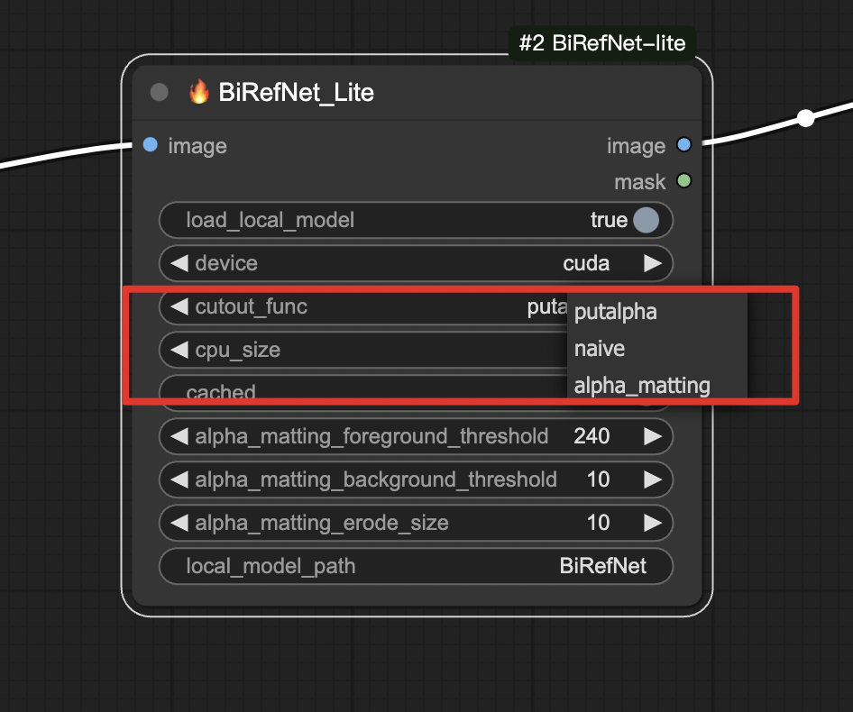

<h1 align="center">ComfyUI-BiRefNet-lite</h1>

      中文 | <a href="README_EN.md">English</a>

## 介绍

本仓库将BiRefNet最新模型封装为ComfyUI节点来使用，并支持cpu和gpu分块加载，模型缓存特性。 
## 特性
特性1: 支持cpu和gpu分块加载 
在开启cuda的情况下，指定cpu_size，可将模型部分加载到cpu上
 
特性2: 模型缓存 
特性3: 多种裁剪方式 
支持putalpha, naive, alpha_matting三种裁剪方式
 
 

## 安装 

#### 方法1:

1. 进入节点目录, `ComfyUI/custom_nodes/`
2. `git clone https://github.com/rubi-du/ComfyUI-BiRefNet-lite.git`
3. `cd ComfyUI-BiRefNet-lite`
4. `pip install -r requirements.txt`
5. 重启ComfyUI

#### 方法2:
直接下载节点源码包，然后解压到custom_nodes目录下，最后重启ComfyUI

#### 方法3：
通过ComfyUI-Manager安装，搜索“ComfyUI-BiRefNet-lite”进行安装

## 使用

示例工作流放置在`ComfyUI-BiRefNet-lite/workflow`中 

加载模型支持两种方式，一种是自动下载远程模型并加载模型，另外一种是加载本地模型。加载本地模型的时候需要把load_local_model设置为true，并把local_model_path设置为本地模型所在路径，例如：H:\ZhengPeng7\BiRefNet 

___

模型下载地址： 
BiRefNet: https://huggingface.co/ZhengPeng7/BiRefNet/tree/main 
BiRefNet_lite-2K: https://huggingface.co/ZhengPeng7/BiRefNet_lite-2K/tree/main 
BiRefNet-portrait: https://huggingface.co/ZhengPeng7/BiRefNet-portrait/tree/main 
BiRefNet-matting: https://huggingface.co/ZhengPeng7/BiRefNet-matting/tree/main 
RMBG-2.0: https://huggingface.co/briaai/RMBG-2.0/tree/main 

___
工作流workflow.json的使用 

___
工作流video_workflow.json的使用 
[workflow地址](./workflow/video_workflow.json)

## 感谢

感谢BiRefNet仓库的所有作者 [ZhengPeng7/BiRefNet](https://github.com/zhengpeng7/birefnet)

部分代码参考了 [MoonHugo/ComfyUI-BiRefNet-Hugo](https://github.com/MoonHugo/ComfyUI-BiRefNet-Hugo) 感谢！